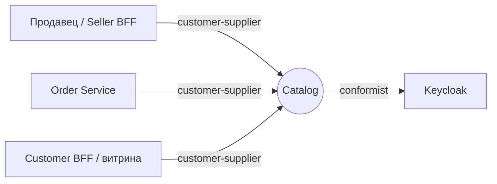
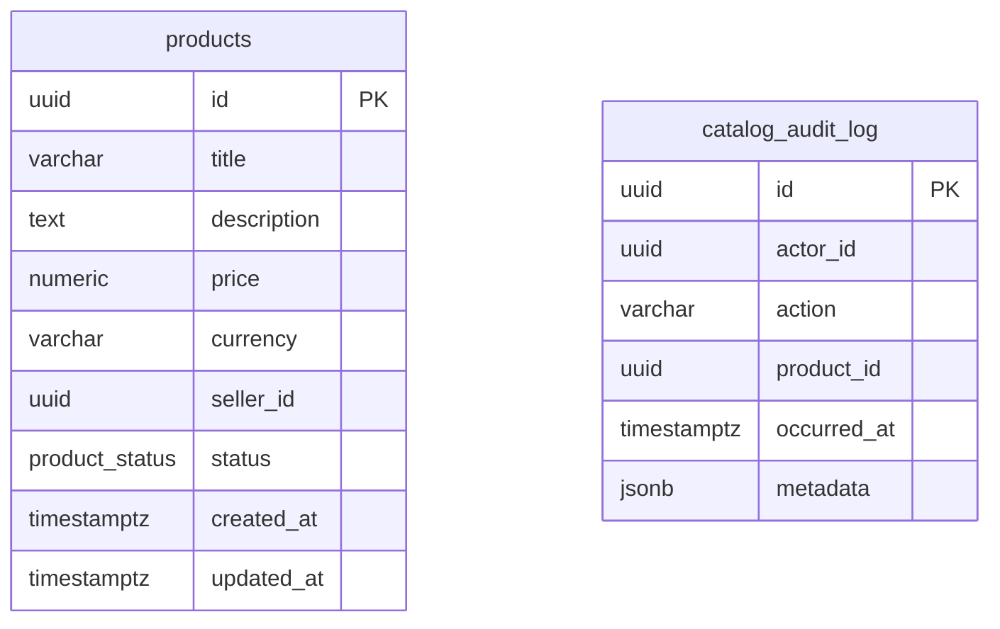

# Catalog Service - Use Case спецификация (Уровень 2)

Контекст **Catalog** маркетплейс-кейса: продавец заводит карточку товара, меняет цену, публикует, скрывает; Order Service берёт цену по `productId`. Уровень 2: команда и обработчик сценария с явными портами, без DDD-агрегатов с событиями, саг и read-моделей. Домен-юнит - сущность **Product** - в [`aggregates/product.md`](aggregates/product.md). Этот файл - секции уровня контекста.

## 1. Bounded Context

**Контекст:** Catalog. **Субдомен:** Supporting - обслуживает основной поток заказа и витрину, но не несёт ядровую сложность маркетплейса. **Владелец:** команда «Каталог». **Миссия:** быть единственным владельцем концепта Product и его жизненного цикла.

### Домен-юниты

| Юнит | Назначение | Файл |
|---|---|---|
| `Product` (сущность) | Карточка товара продавца со статусом `DRAFT -> PUBLISHED <-> HIDDEN` | [`aggregates/product.md`](aggregates/product.md) |

### В границе контекста

- Создание, смена цены, публикация и скрытие карточек товаров.
- Контроль перехода `DRAFT -> PUBLISHED <-> HIDDEN`.
- Хранение базовых атрибутов: title, description, price, currency, seller, status.
- Синхронная выдача цены по `productId` (для Order Service).
- Личный кабинет продавца: «мои продукты».
- Журнал действий администратора над чужими карточками.

### Вне границы

- **Витрина покупателя** - публичный листинг, поиск, категории, фото, отзывы (Customer BFF / витрина).
- **Категории** - затёрли бы границу с витриной; в скоупе кейса не нужны.
- **Остатки и склад** - Inventory Service.
- **Фото и файлы** - Media Service.
- **Поиск по тексту** - Elasticsearch / OpenSearch.
- **Аутентификация** - IdP (Keycloak).

### Стыки с соседями

| Сосед | Тип связи | Суть |
|---|---|---|
| Order Service | customer-supplier (Catalog - supplier) | читает цену опубликованного товара |
| Seller BFF / Customer BFF | customer-supplier (Catalog - supplier) | команды продавца и чтение карточки |
| Keycloak | conformist | Catalog принимает контракт токена как есть |

## 2. Интеграции (Context Map)

| Ребро | Направление | Канал | Связь | Контракт |
|---|---|---|---|---|
| Order Service -> Catalog | inbound | sync | customer-supplier (ohs) | [`catalog.openapi.yaml`](../catalog.openapi.yaml) |
| Seller/Customer BFF -> Catalog | inbound | sync | customer-supplier (ohs) | [`catalog.openapi.yaml`](../catalog.openapi.yaml) |
| Catalog -> Keycloak | outbound | sync | conformist | OIDC / JWKS |

### Контракты

- REST (входящий, владелец - Catalog): `docs/catalog.openapi.yaml`.
- Async: **нет**. Catalog не публикует доменных событий и не подписывается - Kafka-топиков нет (см. [Доменные события](#5-доменные-события)).

## 3. Ubiquitous Language

| Термин | Определение |
|---|---|
| **Product** | Карточка товара конкретного продавца. Один iPhone у двух продавцов - два разных Product; склейки SKU нет. |
| **Seller** | Продавец маркетплейса. У продукта ровно один владелец-продавец. |
| **Status** | Состояние карточки: `DRAFT`, `PUBLISHED`, `HIDDEN`. Перевод - отдельная команда. |
| **Опубликованный товар** | Product в `PUBLISHED` - единственное состояние, видимое Order Service и витрине. |
| **Журнал администратора** | Запись о действии `admin` над чужой карточкой: кто, что, с чем, когда. Действия продавца над своими карточками в журнал не попадают. |

**Намеренно нет:** Category (см. [границы](#1-bounded-context)); Aggregate / Value Object / Domain Event / Saga - это Уровень 3, в Catalog избыточно (модель плоская).

## 4. Роли и доступ

| Роль | Кто это |
|---|---|
| `seller` | продавец; работает только со своими продуктами |
| `admin` | те же операции для любого продавца (перебивает ABAC), каждое действие над чужой карточкой пишется в журнал |
| `public` (без auth) | анонимный читатель - только опубликованная карточка |
| `service-account` | сервис-к-сервису (Order Service) - чтение опубликованной карточки |

**Общий ABAC:** идентификатор продавца из токена (`sub`) сравнивается с владельцем продукта; несовпадение на изменяющих операциях - «не найдено» (не раскрываем существование чужого). `admin` обходит. Доступ по операциям - в матрице [`aggregates/product.md` -> Доступ](aggregates/product.md#3-доступ).

**PII:** Catalog не хранит персональные данные - только бизнес-атрибуты товара и идентификаторы продавца и администратора.

## 5. Доменные события

**Не применимо на Уровне 2.** Catalog не публикует доменных событий и не подписывается. Изменения статуса соседи наблюдают синхронно через REST.

## 6. Use Cases

### UC-C1 - Продавец заводит и публикует продукт

**Актор:** seller. **Поток:** заполняет форму -> `CreateProduct` (карточка `DRAFT`, серверный id) -> проверяет превью -> `PublishProduct` (проверка владельца и перехода, -> `PUBLISHED`). **Альтернативы:** цена <= 0 / валюта не RUB - отказ (`BR-P01`/`BR-P02`); публикация чужого - «не найдено» (`BR-P04`). Команды - [`aggregates/product.md`](aggregates/product.md#5-команды).

### UC-C2 - Order Service берёт цену

**Актор:** service-account (Order Service). **Поток:** для каждого товара `GetProduct` -> цена и атрибуты, если `PUBLISHED`. **Альтернативы:** `DRAFT`/`HIDDEN`/нет - «не найдено» (`BR-P06`), Order не использует черновик.

### UC-C3 - Продавец временно скрывает продукт

**Актор:** seller. **Поток:** `HideProduct` (проверка владельца, `PUBLISHED` -> `HIDDEN`) -> Order и витрина перестают видеть. **Альтернативы:** скрытие не из `PUBLISHED` - недопустимый переход (`BR-P05`).

### UC-C4 - Чужой продавец меняет чужой продукт

**Актор:** seller (не владелец). **Поток:** смена цены, публикация или скрытие чужого -> проверка владельца не проходит (`BR-P04`) -> «не найдено» (существование чужого не раскрывается).

### UC-C5 - Продавец меняет цену

**Актор:** seller. **Поток:** `ChangeProductPrice` (проверка владельца, строка под блокировкой, `BR-P01`, округление до копеек) -> новая цена видна Order и витрине. **Альтернативы:** цена <= 0 - отказ ещё на границе (`VALIDATION_ERROR`); чужой товар - «не найдено».

### UC-C6 - Администратор правит чужую карточку

**Актор:** admin. **Поток:** любая изменяющая команда над карточкой любого продавца -> изменение проходит -> в журнал ложится запись: кто, какое действие, над каким товаром, с чего на что, чей товар. **Альтернативы:** продавец над своей карточкой - запись не создаётся.

## 7. Процессы

**Не применимо на Уровне 2.** Кросс-юнит процессов и распределённых транзакций нет. Каждая команда - одна локальная транзакция; запись журнала идёт в той же транзакции, что и изменение.

## 8. UI-спецификация

Catalog собственного UI не показывает - работает за Seller BFF (кабинет) и Customer BFF (витрина).

| Статус | Бейдж | Смысл |
|---|---|---|
| `DRAFT` | «Черновик» | создан, не виден покупателям и заказам |
| `PUBLISHED` | «Опубликован» | виден витрине, доступен для заказа |
| `HIDDEN` | «Скрыт» | временно снят, можно опубликовать снова |

| Ситуация | Текст пользователю |
|---|---|
| Товар не найден / чужой / не опубликован | Товар не найден. |
| Недопустимый переход статуса | Действие недоступно в текущем статусе товара. |
| Некорректная цена | Цена должна быть больше нуля. |
| Неподдерживаемая валюта | Поддерживается только рубль (RUB). |

Публичный листинг `PUBLISHED` Catalog отдаёт как есть (страница, сортировка); агрегация и кэш витрины - на стороне Customer BFF.

## 9. Критерии приёмки

| AC | Given / When / Then |
|---|---|
| AC-C1 | **Given** продавец; **When** создаёт товар; **Then** карточка `DRAFT` с серверным id. |
| AC-C2 | **Given** свой товар `DRAFT`/`HIDDEN`; **When** публикует; **Then** `PUBLISHED`. |
| AC-C3 | **Given** свой товар `PUBLISHED`; **When** скрывает; **Then** `HIDDEN`. |
| AC-C4 | **Given** чужой товар; **When** не-владелец меняет цену, публикует или скрывает; **Then** «не найдено». |
| AC-C5 | **Given** уже `PUBLISHED`; **When** публикуют повторно (или скрывают не из `PUBLISHED`); **Then** «недопустимый переход». |
| AC-C6 | **Given** создание или смена цены; **When** цена <= 0 / null; **Then** «некорректная цена», в базе ничего не меняется. |
| AC-C7 | **Given** товар; **When** публичное чтение по id; **Then** данные при `PUBLISHED`, иначе «не найдено». |
| AC-C8 | **Given** продавец; **When** «мои товары»; **Then** только свои (любых статусов), с пагинацией. |
| AC-C9 | **Given** свой товар; **When** владелец меняет цену; **Then** новая цена в ответе и в базе, журнал пуст. |
| AC-C10 | **Given** чужой товар; **When** `admin` меняет цену; **Then** цена изменена, в журнале запись `PRODUCT_PRICE_CHANGED`. |
| AC-C11 | **Given** изменяющая команда; **When** без токена; **Then** 401 `TOKEN_MISSING`, в базе ничего не меняется. |
| AC-C12 | **Given** карточки разных статусов; **When** витрина без токена; **Then** только `PUBLISHED`, с пагинацией и сортировкой. |

## 10. Нефункциональные требования

| Атрибут | Цель |
|---|---|
| Производительность (чтение) | `GetProduct` p95 <= 50 мс; критично - Order дёргает в цикле |
| Производительность (запись) | публикация p95 <= 100 мс |
| Ёмкость | ~100 RPS чтение, ~5 RPS запись |
| Доступность | stateless, горизонтальное масштабирование без шардирования |
| Согласованность | строгая в транзакции команды; межсервисная - на чтении (синхронно) |
| Безопасность | JWT (OAuth2 Resource Server); ABAC по владельцу; PII нет; TLS обязателен |
| Наблюдаемость | метрики создания и переходов, латентность чтения; `productId`/`sellerId`/`requestId` в логах; трейсинг |
| Эксплуатация | миграции при старте; один экземпляр держит стартовую нагрузку |

## 11. Техническая реализация

Единственный технический раздел; всё выше - домен.

**Контейнеры (C2):** один контейнер - Python-сервис Catalog (uvicorn); внешнее состояние - PostgreSQL; внешняя зависимость - Keycloak (JWKS).

| Слой | Стек | Реализация |
|---|---|---|
| Платформа | Python 3.12+, FastAPI, uvicorn | один пакет `catalog`, подпакеты `core` / `adapter` / `bootstrap` |
| REST | FastAPI, pydantic | роутер реализует операции OpenAPI; схема pydantic <-> команда-dataclass; роли в зависимостях, владение в обработчике сценария |
| Безопасность | PyJWT с JWKS | JWT по ключам Keycloak; роли из `realm_access.roles`; режим `AUTH_MODE=local` - токены вида `role.uuid` для стенда и тестов |
| Бизнес-операции | ядро без зависимостей | команда - `dataclass`, обработчик - класс с портами-протоколами; единица работы оборачивает команду в транзакцию |
| Хранение | SQLAlchemy 2 Core (async), asyncpg | запросы в адаптере хранения, строка <-> `Product.restore`; сессия транзакции в `contextvars` |
| БД | PostgreSQL 16, Alembic | схема в `migrations/versions/`, накатывается при старте |
| Ошибки | RFC 9457 Problem Details | обработчики исключений FastAPI переводят `AppError` в код и статус |
| Тесты | pytest, httpx против ASGI | на настоящем PostgreSQL (`catalog_test`), архитектурный тест на `ast` |

### Коды ошибок -> HTTP

| `code` | HTTP | Когда |
|---|---|---|
| `VALIDATION_ERROR` | 400 | тело или параметр не прошли схему: пустое название, цена не больше нуля, не UUID |
| `MALFORMED_REQUEST` | 400 | тело запроса не разобрать |
| `INVALID_PRICE` | 400 | `price <= 0` дошла до ядра |
| `INVALID_CURRENCY` | 400 | валюта не RUB |
| `PRODUCT_NOT_FOUND` | 404 | продукт не существует / `DRAFT`\|`HIDDEN` при публичном чтении |
| `OWN_PRODUCT_REQUIRED` | 404 | изменение чужого продукта (404, не 403 - не раскрываем существование) |
| `INVALID_STATE_TRANSITION` | 409 | публикация уже `PUBLISHED`, скрытие не из `PUBLISHED` |
| `TOKEN_MISSING` | 401 | изменяющая операция без токена |
| `TOKEN_INVALID` | 401 | токен не разобрать или подпись не сходится |
| `ACCESS_DENIED` | 403 | роль не `seller` и не `admin` |

### Схема БД

Таблица `products`: индексы по `seller_id` (для «мои товары») и `status`; чтение по `id` - по PK; изменяющие команды берут строку `FOR UPDATE`. Таблица `catalog_audit_log` без внешнего ключа на `products`: журнал живёт дольше карточки. Цена и валюта - два поля (`Decimal` + `str`); Value Object `Money` не вводится (Уровень 2). Read Model нет.
